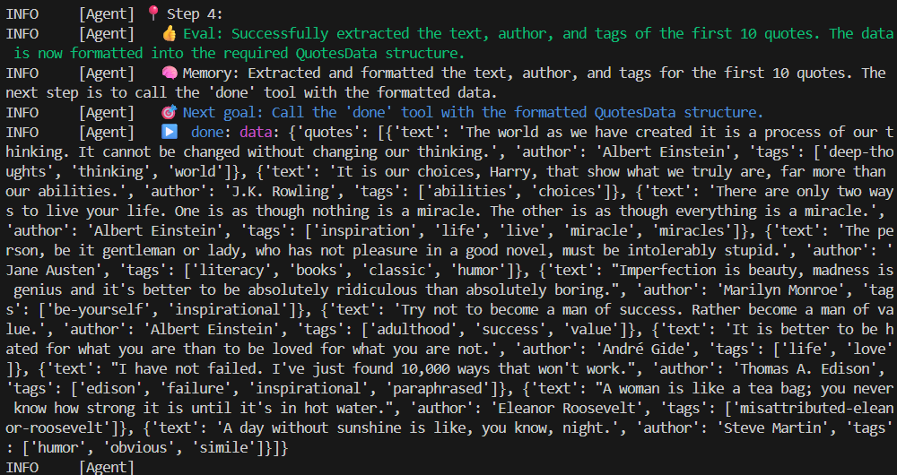
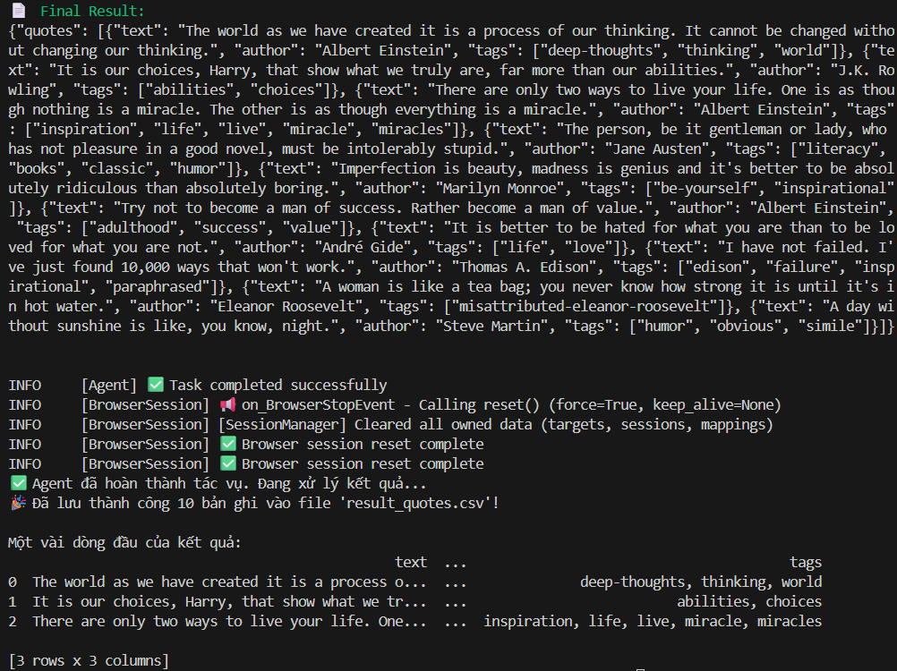

# Browser Agent Demo

Repository này chứa mã nguồn minh họa cách sử dụng thư viện `browser-use` kết hợp với model LLM cục bộ (Ollama) để điều khiển trình duyệt tự động trích xuất dữ liệu từ một trang web.

Đây là bài thực hành thuộc khóa học **AI Guru**, minh họa sức mạnh của việc dùng LLM đọc **Accessibility Tree** thay vì dùng các Selector CSS/XPath truyền thống vốn dễ vỡ.

## 📌 Các file trong Repository

- `agent_builder.py`: Module chứa cấu hình dùng chung (model, limits, allowed_domains, task guardrails) để build agent cho các script khác.
- `scraper_agent.py`: Mã nguồn chính của Browser Agent.
- `result_quotes.csv`: File dữ liệu mẫu (10 câu nói) được Agent trích xuất thành công và xuất ra bằng Pandas.
- `evaluation/`: Thư mục chứa Script chạy test hiệu năng (`eval_runner.py`), script kiểm thử tính năng tự phục hồi (`eval_resilience.py`), kết quả test (`evaluation_results.csv`), và mã nguồn HTML giả lập để thử nghiệm.

## ⚙️ Yêu cầu hệ thống

Để chạy được mã nguồn này, bạn cần cài đặt:

1. **Python 3.11+**
2. Cài đặt các thư viện Python:
   ```bash
   pip install browser-use==0.13.8 playwright pandas pydantic
   playwright install
   ```
3. **Ollama**: Cài đặt [Ollama](https://ollama.com/) và tải model `qwen2.5:7b` (hoặc các model khác tùy cấu hình).
   ```bash
   ollama pull qwen2.5:7b
   ```

## 🚀 Cách chạy thử

Chạy trực tiếp file Python:
```bash
python scraper_agent.py
```

Agent sẽ tự động:
1. Mở một trình duyệt ẩn (headless).
2. Điều hướng đến `https://quotes.toscrape.com/`.
3. Nhìn và phân tích cấu trúc của trang web.
4. Trích xuất đúng 10 bản ghi đầu tiên với đầy đủ các trường `text`, `author`, `tags` theo chuẩn schema của Pydantic.
5. Lưu kết quả ra file `result_quotes.csv`.

*Ảnh chụp Terminal thực tế trong quá trình chạy (xem `assets/terminal_1.png` và `assets/terminal_2.png`)*



### Chạy đánh giá 10 lần
```bash
python evaluation/eval_runner.py
```
Script sẽ chạy Agent 10 lần và lưu kết quả vào: `evaluation/evaluation_results.csv`.

Chạy thử bài test tự phục hồi (Resilience Test):
```bash
python evaluation/eval_resilience.py
```
Script này sẽ chạy Agent trên 2 file HTML local (trước và sau khi đổi CSS/cấu trúc HTML) để minh họa khả năng xử lý một biến thể DOM, và lưu báo cáo vào `evaluation/resilience_results.csv`.

## 🛡 Cân nhắc An toàn (Guardrails)
Mã nguồn này được thiết lập giới hạn vòng lặp tối đa `max_steps=20` để phòng trường hợp LLM bị "ảo giác" (hallucination) dẫn đến lặp vô hạn. Về việc thu thập dữ liệu, trang `quotes.toscrape.com` trả về mã 404 cho `robots.txt` vì đây là một Web Scraping Sandbox được thiết kế riêng để thực hành scraping, do đó rủi ro pháp lý/đạo đức ở mức thấp. Tuy nhiên, lập trình viên vẫn cần tuân thủ các quy chuẩn đạo đức chung (không vượt quá giới hạn hoặc quá tải máy chủ). Trong code, agent cũng đã bị khóa hoàn toàn trong domain này.
